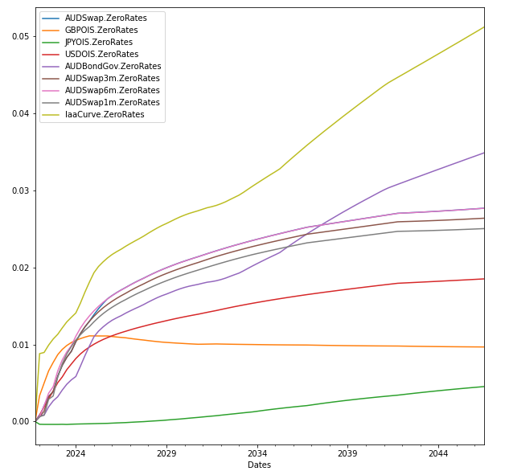
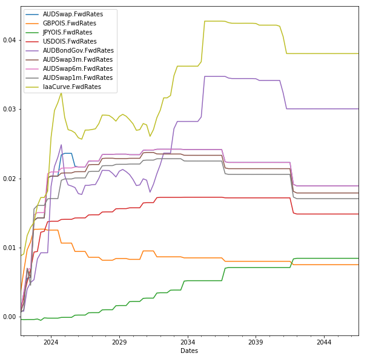
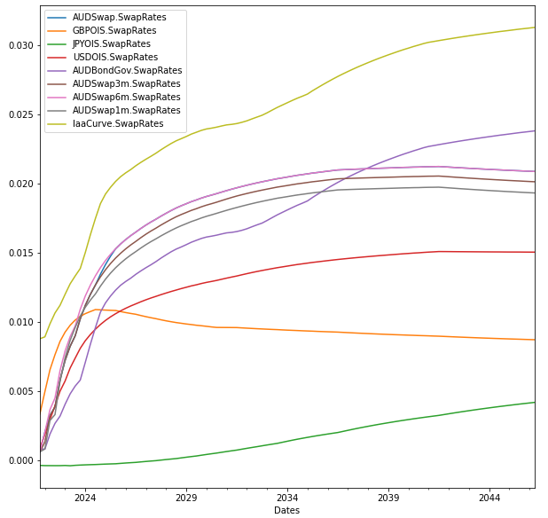
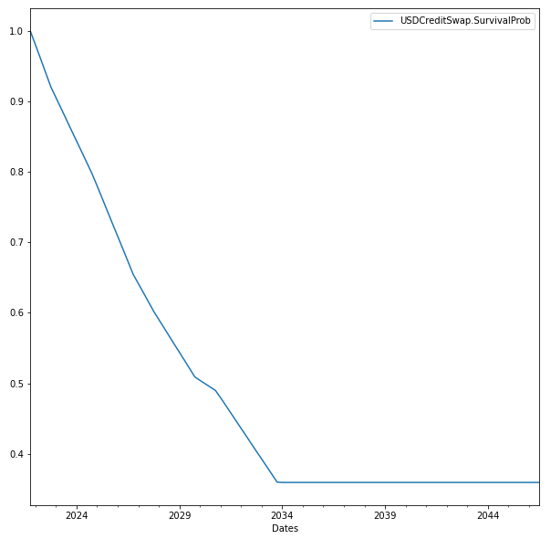
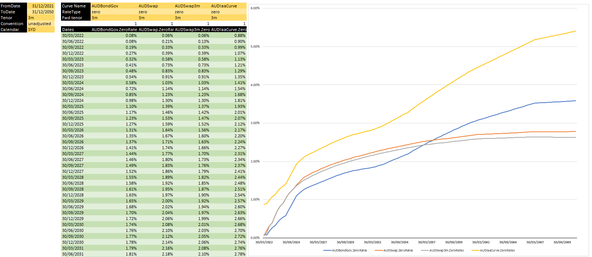

##Chart Functions

###Python Interface
****
####Yield Curve
**Note:** The function works with one or multiple curves in a list

Currently supported Rate Type
| Curve Type                    | Rate Type                      |
|-------------------------------|--------------------------------|
| Yield Curve SpreadYield Curve | zero, fwd, swaprate, df        |
| Credit Curve                  | SurvivalProbability, HazardRate|
| Inflation Curve               | CPI, CPIRate                   |
| Price Curve                   | Price                          |
```
import dateutil.relativedelta 
date_list = [valueDate + dateutil.relativedelta.relativedelta(months=3*x) for x in range(100)] 
#Zero rates
df = mkt.Charts(list(baseMarket.marketItems.values()), 'zero', date_list)
df.plot(figsize=(10,10))
```


```
#Foward Rates
df = mkt.Charts(list(baseMarket.marketItems.values()), 'fwd', date_list)
df.plot(figsize=(10,10))
```

```
#Swap Rates
df = mkt.Charts(list(baseMarket.marketItems.values()), 'swaprate', date_list)
df.plot(figsize=(10,10))
```

####Credit Curve
```
df = mkt.Charts(baseMarket['usdcreditswap'], 'survivalprob', date_list)
df.plot(figsize=(10,10))
```


###Excel Interface
****
```
=ScheduleCreate(FromDate,ToDate,Tenor,Convention,Calendar)
=MarketChartPoints(MarketHandle,CurveName,RateType,DatesRange,Fwd Tenor)
#Fwd Tenor: only applies to Fwd rates, ignored for other RateType
```
