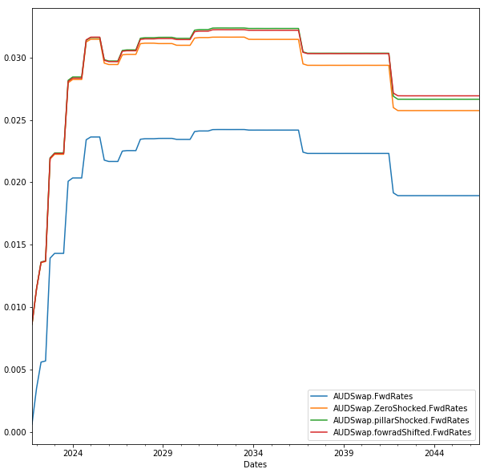

##Other Functions

###Risk Functions
Currently supported Shock Type
| Curve Type                    | Shock Type                      |
|-------------------------------|--------------------------------|
| Yield Curve, SpreadYieldCurve | zero, pillar, forward rate      |

###Python Interface
****
1. Function to calculate the delta of a 1mil notional of AUDSwap with 1bp shock
   (User can choose any curves and the function will return the delta for each of corresponding pillar)
```python
audswapCurve = baseMarket['AUDSwap']
audswapCurve.Dv01AtEachpillar('pillar')
```
| Pillar     | Delta |
|:-----------|------------:|
| AUDBILL1M  |    -9.58899 |
| AUDBILL2M  |   -17.2598  |
| AUDBILL3M  |   -25.7499  |
| AUDBILL6M  |   -50.6349  |
| AUDSwap1Y  |   -99.8144  |
| AUDSwap2Y  |  -198.555   |
| AUDSwap3Y  |  -296.328   |
| AUDSwap4Y  |  -390.153   |
| AUDSwap5Y  |  -482.411   |
| AUDSwap6Y  |  -572.897   |
| AUDSwap7Y  |  -661.556   |
| AUDSwap8Y  |  -747.932   |
| AUDSwap9Y  |  -832.774   |
| AUDSwap10Y |  -914.947   |
| AUDSwap12Y | -1073.92    |
| AUDSwap15Y | -1298.91    |
| AUDSwap20Y | -1641.1     |
| AUDSwap25Y | -1949.7     |
| AUDSwap30Y | -2233.01    |
| AUDSwap50Y | -3127.14    |
2. Shock on different types
```python
#Example below: we shock the zero, pillar, fwd rates by 80bps
import dateutil.relativedelta 
date_list = [valueDate + dateutil.relativedelta.relativedelta(months=3*x) for x in range(100)] 
audSwap = baseMarket['audswap']
zeroShockedCurve = audSwap.CreateShockedCurve('zero',shockAmount = 0.005, period = '3m', yearBasis = 'acton365f')
pillarShockedCurve = audSwap.CreateShockedCurve('pillar',shockAmount = 0.005, period = '3m', yearBasis = 'acton365f')
fwdShockedCurve = audSwap.CreateShockedCurve('foward',shockAmount = 0.005, period = '3m', yearBasis = 'acton365f')
df = mkt.Charts([audSwap,zeroShockedCurve,pillarShockedCurve,fwdShockedCurve], 'fwd', date_list,'3m')
df.plot(figsize=(10,10))
```



###Info Functions
1. Returns the input pillars info for a Curve
```python
#Item Info
audswapCurve = baseMarket['AUDSwap']
audswapCurve.ItemInfo()
```
| Startdate   | Maturitydate   | Ccy   | Label      | Rateconvention   | Yearbasis   |      Rate | Paymentfrequency   | Calendar   | Quotetype   | Compoundfrequency   | Paymentdelay   |
|:------------|:---------------|:------|:-----------|:-----------------|:------------|----------:|:-------------------|:-----------|:------------|:--------------------|:---------------|
| 04/01/2022  | 04/02/2022     | AUD   | AUDBILL1M  | linear           | acton365f   | 0.00015   | zero               | 'SYD'      | DepositRate | nan                 | nan            |
| 04/01/2022  | 04/03/2022     | AUD   | AUDBILL2M  | linear           | acton365f   | 0.000257  | zero               | 'SYD'      | DepositRate | nan                 | nan            |
| 04/01/2022  | 04/04/2022     | AUD   | AUDBILL3M  | linear           | acton365f   | 0.000677  | zero               | 'SYD'      | DepositRate | nan                 | nan            |
| 04/01/2022  | 04/07/2022     | AUD   | AUDBILL6M  | linear           | acton365f   | 0.002135  | zero               | 'SYD'      | DepositRate | nan                 | nan            |
| 04/01/2022  | 04/01/2023     | AUD   | AUDSwap1Y  | linear           | acton365f   | 0.003921  | quarterly          | 'SYD'      | SwapRate    | Zero                | 0d             |
| 04/01/2022  | 04/01/2024     | AUD   | AUDSwap2Y  | linear           | acton365f   | 0.009084  | quarterly          | 'SYD'      | SwapRate    | Zero                | 0d             |
| 04/01/2022  | 06/01/2025     | AUD   | AUDSwap3Y  | linear           | acton365f   | 0.0128    | quarterly          | 'SYD'      | SwapRate    | Zero                | 0d             |
| 04/01/2022  | 05/01/2026     | AUD   | AUDSwap4Y  | linear           | acton365f   | 0.01545   | semiannual         | 'SYD'      | SwapRate    | Zero                | 0d             |
| 04/01/2022  | 04/01/2027     | AUD   | AUDSwap5Y  | linear           | acton365f   | 0.01665   | semiannual         | 'SYD'      | SwapRate    | Zero                | 0d             |
| 04/01/2022  | 04/01/2028     | AUD   | AUDSwap6Y  | linear           | acton365f   | 0.01759   | semiannual         | 'SYD'      | SwapRate    | Zero                | 0d             |
| 04/01/2022  | 04/01/2029     | AUD   | AUDSwap7Y  | linear           | acton365f   | 0.01839   | semiannual         | 'SYD'      | SwapRate    | Zero                | 0d             |
| 04/01/2022  | 04/01/2030     | AUD   | AUDSwap8Y  | linear           | acton365f   | 0.01899   | semiannual         | 'SYD'      | SwapRate    | Zero                | 0d             |
| 04/01/2022  | 06/01/2031     | AUD   | AUDSwap9Y  | linear           | acton365f   | 0.01945   | semiannual         | 'SYD'      | SwapRate    | Zero                | 0d             |
| 04/01/2022  | 05/01/2032     | AUD   | AUDSwap10Y | linear           | acton365f   | 0.019875  | semiannual         | 'SYD'      | SwapRate    | Zero                | 0d             |
| 04/01/2022  | 04/01/2034     | AUD   | AUDSwap12Y | linear           | acton365f   | 0.02053   | semiannual         | 'SYD'      | SwapRate    | Zero                | 0d             |
| 04/01/2022  | 05/01/2037     | AUD   | AUDSwap15Y | linear           | acton365f   | 0.021175  | semiannual         | 'SYD'      | SwapRate    | Zero                | 0d             |
| 04/01/2022  | 06/01/2042     | AUD   | AUDSwap20Y | linear           | acton365f   | 0.021425  | semiannual         | 'SYD'      | SwapRate    | Zero                | 0d             |
| 04/01/2022  | 04/01/2047     | AUD   | AUDSwap25Y | linear           | acton365f   | 0.0210375 | semiannual         | 'SYD'      | SwapRate    | Zero                | 0d             |
| 04/01/2022  | 04/01/2052     | AUD   | AUDSwap30Y | linear           | acton365f   | 0.02043   | semiannual         | 'SYD'      | SwapRate    | Zero                | 0d             |
| 04/01/2022  | 04/01/2072     | AUD   | AUDSwap50Y | linear           | acton365f   | 0.02043   | semiannual         | 'SYD'      | SwapRate    | Zero                | 0d             |

