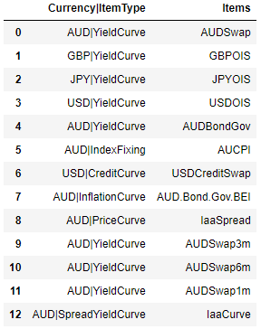
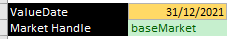
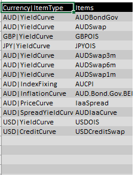
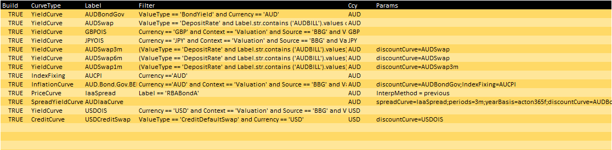

# Interest Rates Market Add-in

## Description

* The package uses Scipy for Newton-Raphson optimization.
* A multiprocessing framework is also embedded to speed up the market building process
* It also provides the flexiblity for users to choose which instruments to use in the curve building process

## Installing the Package
The package is not on pip at the moment, user need to clone the repo and install locally
```python
pip install -e C:\Users\Zongjie\source\repos\zongjieshen\RatesMarket
```
**_NOTE:_** Replace the repo directory with your own

### Executing program
1. Any Jupter Notebook should be able to import the package installed locally
2. A Spreadsheet 'MarketAddin.xlsm' with xlwings added-in is also attached (You need to install xlwings add-in and Enable xlwings references in VBA, more details at https://docs.xlwings.org/en/stable/udfs.html)

After installing the package, you can import the package as a standard one
##### Notebook
```python
import market as mkt
import pandas as pd
valueDate = pd.to_datetime('31/12/2021',format = '%d/%m/%Y')
baseMarket = mkt.Create('baseMarket',valueDate)
baseMarket.GetItems()
```



#### Excel
**Note:** Excel workbook name has to be named as 'MarketAddin.xlsm' to work, as xlwings requires the addin module and workbook name to be the same.
In Excel after the xlwings Ribbon is loaded, click Import functions and type the formula
```
=MarketCreate("baseMarket",valueDate,,buildItems)
=MarketItems(marketHandle)
```




**_NOTE:_** In the sample spreadsheet, buildItems is an Excel range and user can define the Curve params.


More useages are defined in the wiki section

## Detailed Functionality

* [Chart Function](https://github.com/zongjieshen/RatesMarket/wiki/Chart-Functions)
* [Risk and Info Function](https://github.com/zongjieshen/RatesMarket/wiki/Other-Functions)

## Version History
* 0.1
    * Initial Release

## License

This project is licensed under the [MIT] License
