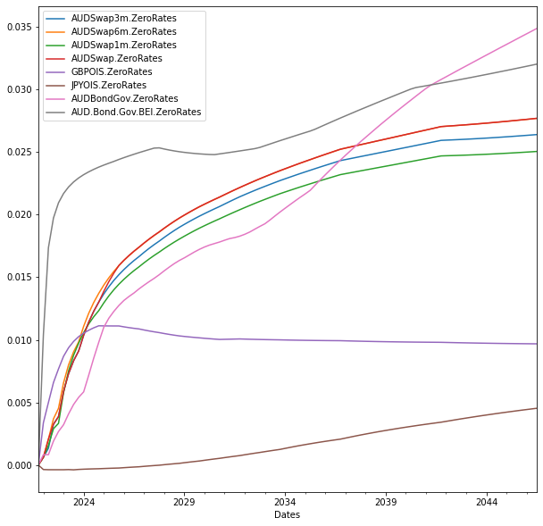
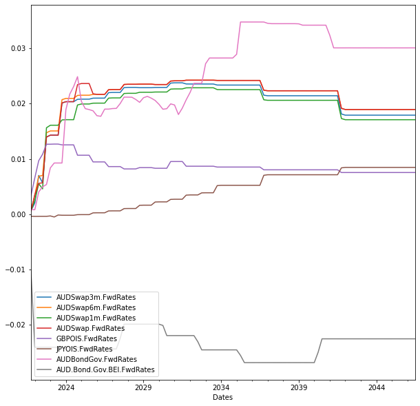

```python
The package Market provides a simple illustration of the Australia Interest Rates market. The package uses Scipy for Newton-Raphson optimization
A Spreadsheet with xlwings added-in is also attached

Usage
1. Create a generic Market handle, user is able to define which curves to be built in the collection
from either the Notebook or the Excel Add-in
2. Provides 2 ways of calculating DV01 Shock, pillar and zero shocks

```


```python
#Build the market
import Market as mkt
import pandas as pd
valueDate = pd.to_datetime('31/12/2021',format = '%d/%m/%Y')
baseMarket = mkt.MarketFactory.Create('baseMarket',valueDate)
```


    ---------------------------------------------------------------------------

    ModuleNotFoundError                       Traceback (most recent call last)

    <ipython-input-1-71eb5982ec64> in <module>
          1 #Build the market
    ----> 2 import Market as mkt
          3 import pandas as pd
          4 valueDate = pd.to_datetime('31/12/2021',format = '%d/%m/%Y')
          5 baseMarket = mkt.MarketFactory.Create('baseMarket',valueDate)
    

    ModuleNotFoundError: No module named 'Market'


```python
#Curve Charts
import dateutil.relativedelta 
date_list = [valueDate + dateutil.relativedelta.relativedelta(months=3*x) for x in range(100)] 
#zero rates
df = mkt.Curve.Charts(list(baseMarket.marketItems.values()), 'zero', date_list,'3m')
df.plot(figsize=(10,10))
```


    <AxesSubplot:xlabel='Dates'>


    

    


```python
#forward rates
df = mkt.Curve.Charts(list(baseMarket.marketItems.values()), 'fwd', date_list,'3m')
df.plot(figsize=(10,10))
```


    <AxesSubplot:xlabel='Dates'>


    

    


```python
#PillarShock DV01 at 1mil notional

audSwap = baseMarket.GetMarketItem('AUDSwap') 
audSwap.Dv01AtEachPillar('pillar',baseMarket, 0.0001, 1000000) 
```


<div>
<style scoped>
    .dataframe tbody tr th:only-of-type {
        vertical-align: middle;
    }

    .dataframe tbody tr th {
        vertical-align: top;
    }

    .dataframe thead th {
        text-align: right;
    }
</style>
<table border="1" class="dataframe">
  <thead>
    <tr style="text-align: right;">
      <th></th>
      <th>Pillar</th>
      <th>Delta</th>
    </tr>
  </thead>
  <tbody>
    <tr>
      <th>0</th>
      <td>AUDBILL1M</td>
      <td>-9.714370</td>
    </tr>
    <tr>
      <th>1</th>
      <td>AUDBILL2M</td>
      <td>-17.384590</td>
    </tr>
    <tr>
      <th>2</th>
      <td>AUDBILL3M</td>
      <td>-25.862434</td>
    </tr>
    <tr>
      <th>3</th>
      <td>AUDBILL6M</td>
      <td>-50.743629</td>
    </tr>
    <tr>
      <th>4</th>
      <td>AUDSwap1Y</td>
      <td>-99.751607</td>
    </tr>
    <tr>
      <th>5</th>
      <td>AUDSwap2Y</td>
      <td>-197.950982</td>
    </tr>
    <tr>
      <th>6</th>
      <td>AUDSwap3Y</td>
      <td>-294.562811</td>
    </tr>
    <tr>
      <th>7</th>
      <td>AUDSwap4Y</td>
      <td>-386.756091</td>
    </tr>
    <tr>
      <th>8</th>
      <td>AUDSwap5Y</td>
      <td>-477.769198</td>
    </tr>
    <tr>
      <th>9</th>
      <td>AUDSwap6Y</td>
      <td>-566.790165</td>
    </tr>
    <tr>
      <th>10</th>
      <td>AUDSwap7Y</td>
      <td>-653.715975</td>
    </tr>
    <tr>
      <th>11</th>
      <td>AUDSwap8Y</td>
      <td>-738.356683</td>
    </tr>
    <tr>
      <th>12</th>
      <td>AUDSwap9Y</td>
      <td>-821.484271</td>
    </tr>
    <tr>
      <th>13</th>
      <td>AUDSwap10Y</td>
      <td>-901.696751</td>
    </tr>
    <tr>
      <th>14</th>
      <td>AUDSwap12Y</td>
      <td>-1056.661266</td>
    </tr>
    <tr>
      <th>15</th>
      <td>AUDSwap15Y</td>
      <td>-1275.727529</td>
    </tr>
    <tr>
      <th>16</th>
      <td>AUDSwap20Y</td>
      <td>-1613.389278</td>
    </tr>
    <tr>
      <th>17</th>
      <td>AUDSwap25Y</td>
      <td>-1928.903071</td>
    </tr>
    <tr>
      <th>18</th>
      <td>AUDSwap30Y</td>
      <td>-2229.512848</td>
    </tr>
    <tr>
      <th>19</th>
      <td>AUDSwap50Y</td>
      <td>-3116.681034</td>
    </tr>
  </tbody>
</table>
</div>


